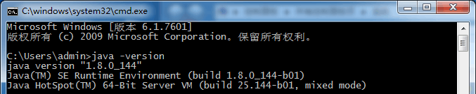
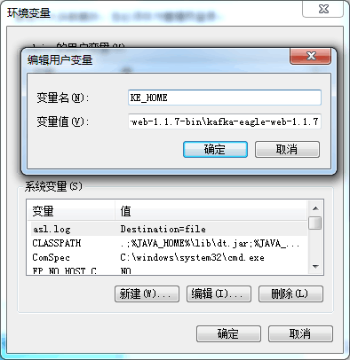

# 2.3 Install on Windows
## 2.3.1 Overview
This page explains how to install EFAK dependencies, download and install EFAK, get the service up and running on your Windows system, and the installation package details.

## 2.3.2 Install JDK
If there is a JDK environment on the Linux server, this step can be ignored, and the installation of the next steps. If there is no JDK, first to the Oracle official website to [download JDK](http://www.oracle.com/technetwork/java/javase/downloads/index.html).

Run the downloaded `*.exe` file installation package directly, then configure environment variables:

## 2.3.3 Check JDK
Finally, we input `java -version`, according to the following information:

## 2.3.4 KE_HOME Configure
Configure environment variables,As shown in the following figure:

## 2.3.5 Start the EFAK server
Go to the `%KE_HOME%\bin` directory and click the `ke.bat` file.
