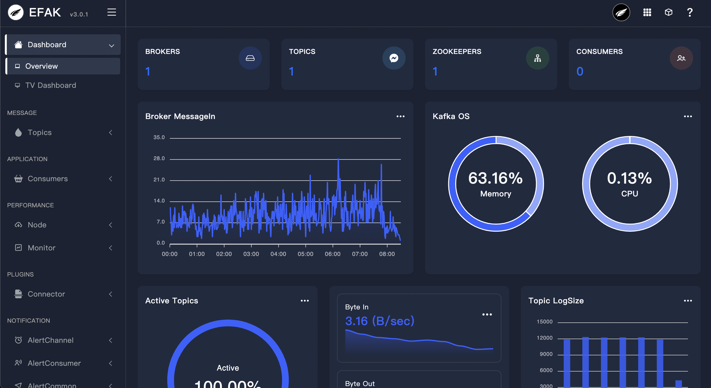

# 3.1 Dashboard
## 3.1.1 Overview
A dashboard is a set of one or more panels organized and arranged into one or more rows. EFAK ships with a variety of Panels. EFAK makes it easy to get the right queries, and customize the display properties so that you can view kafka topic data the perfect dashboard for your need.

## 3.1.2 Dashboard UI

