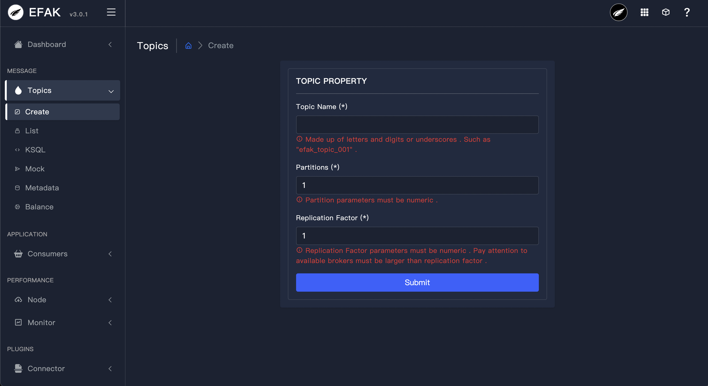
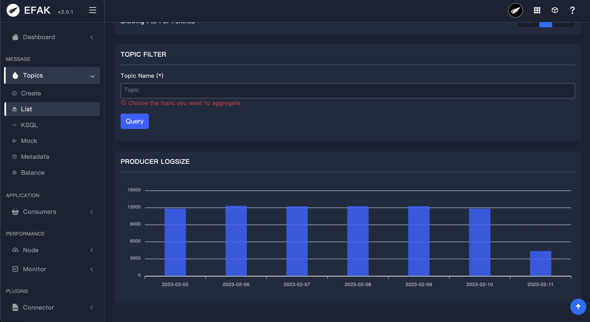
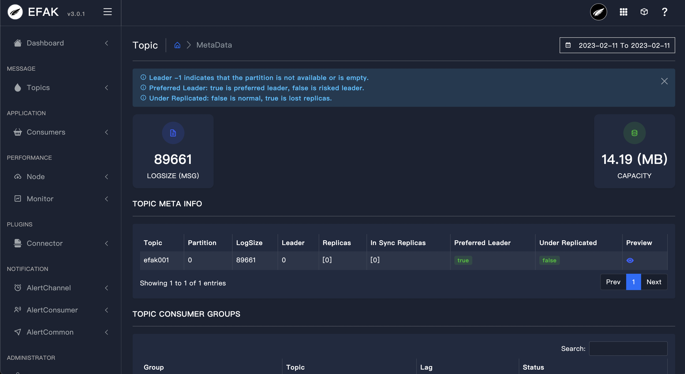
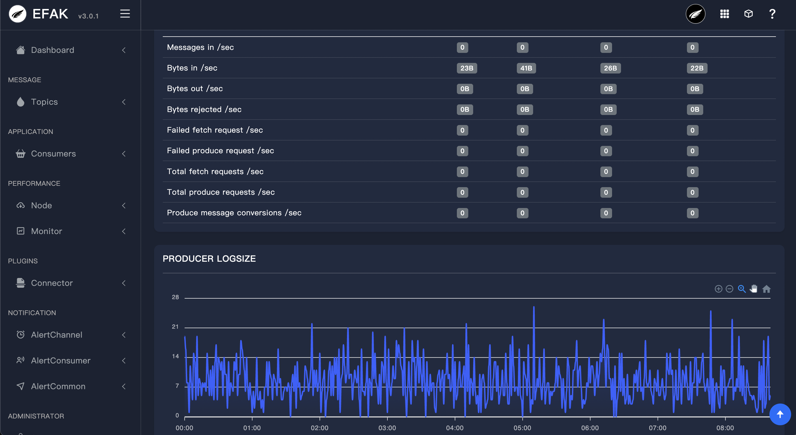
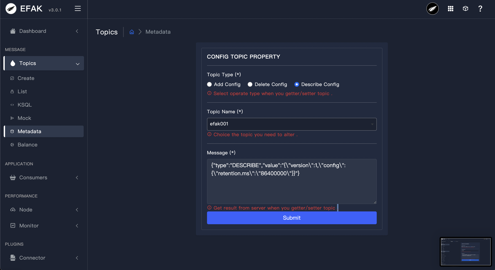
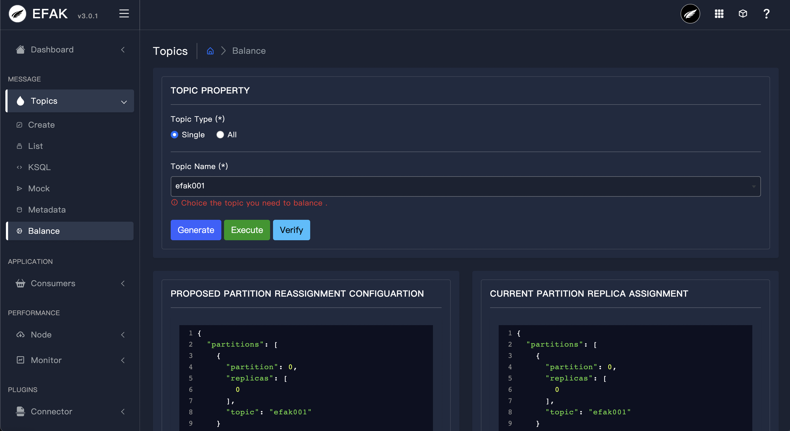

# 3.2 Topics

## 3.2.1 Overview
Topic columns under the current contains the creation and list, through the creation of a module can create a custom partition and the number of backup Topic. As shown in the following figure:

## 3.2.2 Create Topic

## 3.2.3 List Topic
The module follows all the Topic in the Kafka cluster, including the number of partitions, create time, and modify the Topic, as shown in the following figure:

## 3.2.4 Produce LogSize

## 3.2.5 Topic Detail

## 3.2.6 Topic MBean

## 3.2.7 Topic Config

## 3.2.8 Topic Balance

