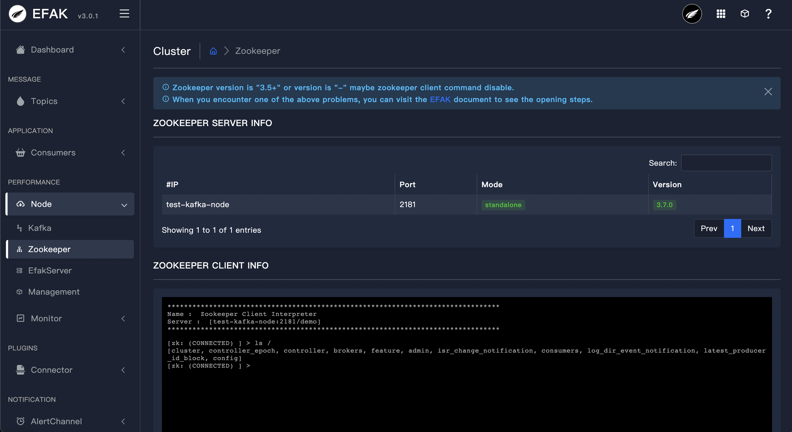

# 3.4 Clusters

## 3.4.1 Overview
This module displays Kafka cluster information and Zookeeper cluster information, including the following:

* Kafka broker host, IP, memory, version etc.
* Zookeeper host, IP, status, version etc.
* EFAK server.
* Kafka cluster management.

As shown in the following figure.

## 3.4.2 Kafka

## 3.4.3 Zookeeper

## 3.4.4 EFAK Server

## 3.4.5 Management

