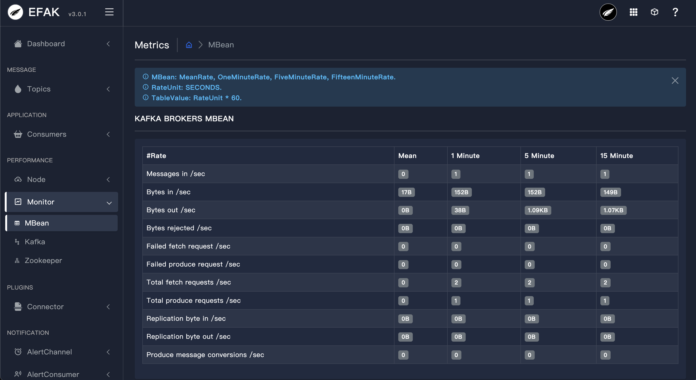
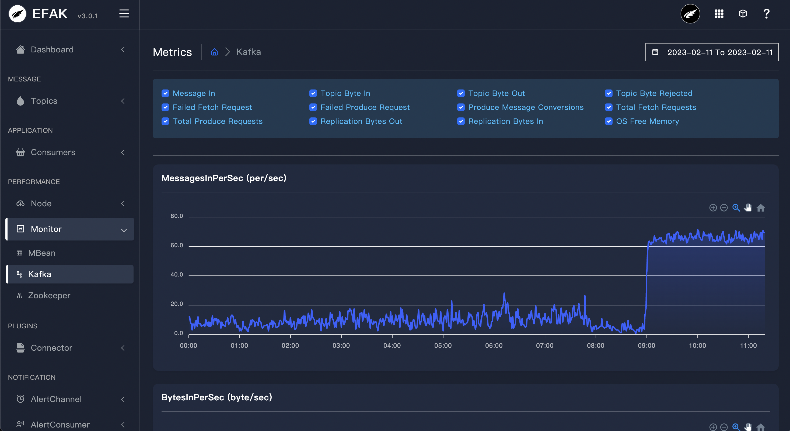

# 3.8 Metrics

## 3.8.1 Overview
Through JMX to obtain data, monitor the Kafka client, the production side, the number of messages, the number of requests, processing time and other data to visualize performance.

## 3.8.2 Kafka MBean

## 3.8.3 Kafka Performance

## 3.8.4 Kafka Broker Collection
EFAK monitoring summarizes the node data of the whole cluster. Through the monitoring chart, you can observe the running state of the cluster.

| Quota | Message |
| :----- | :----- |
|MessagesInPerSec | Broker aggregate incoming message rate.|
|BytesInPerSec | Broker aggregate incoming byte rate.|
|BytesOutPerSec| Broker aggregate outgoing byte rate.|
|BytesRejectedPerSec|Broker aggregate rejected byte rate.|
|FailedFetchRequestsPerSec|Broker fetch request rate for requests that failed.|
|FailedProduceRequestsPerSec|Produce request rate for requests that failed.|
|ProduceMessageConversionsPerSec|The number of produce message conversions per second for the broker.|
|ReplicationBytesInPerSec|Byte in rate from other brokers.|
|ReplicationBytesOutPerSec|Byte out rate to other brokers.|
|TotalFetchRequestsPerSec|Fetch request rate.|
|TotalProduceRequestsPerSec |Produce request rate.|
|FreePhysicalMemorySize|Broker free memory size.|
