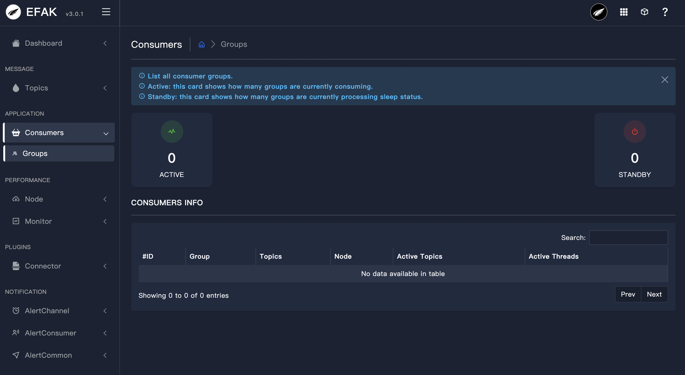

# 3.3 Consumers

### 3.3.1 Overview
The module shows the Topic information of consumer records, which contains the following contents:

* Running
* Pending
* Shutdown
* Active Topic Graph
As shown in the following figure:

