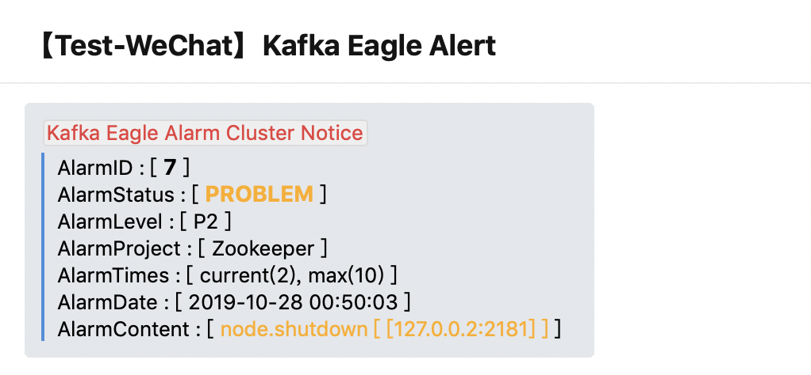

# 5.Alarm

## 3.5.1 Overview

New alarm module, to pay attention to their own Topic alarm settings. No consumer information when Topic, more than the threshold, the alarm. At present, the alarm way through the message to the alarm, set as shown in the following figure:

## 3.5.2 Support IM

In addition to supporting email or webhook alerts, EFAK also supports im alerts, such as DingDing and WeChat.

## 3.5.3 Mail

First of all, it is necessary to configure alarm channels, select different alarm modes, and divide different alarm groups.

If you have the username and password of the mail server, you can use the following method to set the information about your mail server into the following JSONObject.

```json
{"host":"smtp.126.com","port":"465","sa":"ke","username":"ke@126.com","password":"*********","enable_ssl":true}
```


## 3.5.4 DingDing

We can choose to use `DingDing` as the alarm interface, as shown in the following figure:&#x20;


## 3.5.5 WeChat

We can choose to use `WeChat` as the alarm interface, as shown in the following figure:&#x20;


