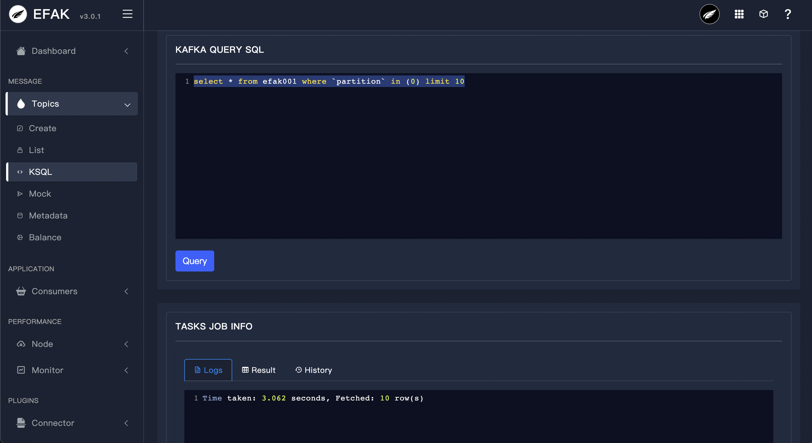
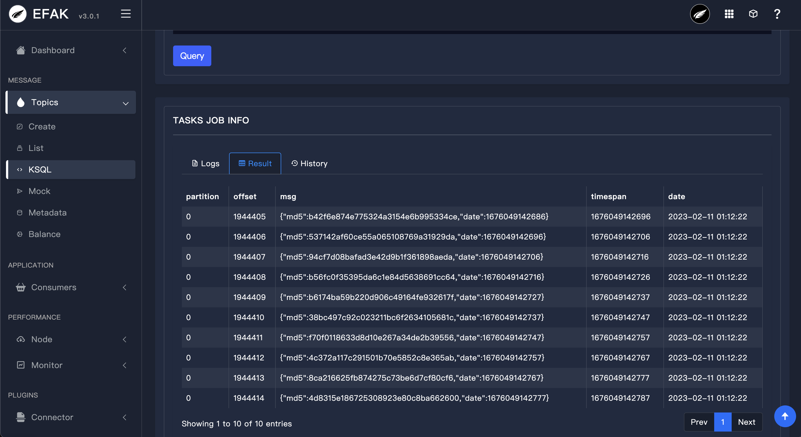

# 3.7 KSQL

## 3.7.1 Overview
Use the SQL statement to the news data visualization in topic, for SQL queries, and table names field need to use double quotes to mark, example SQL is as follows:
```sql
select * from efak001 where `partition` in (0) limit 10
```
As shown in the following figure:





> [!tip]
> Access to topic message data, depending on the underlying interface record of the earliest and latest offset, the default display up to 5000 records.

## 3.7.2 Parse JSONObject Or JSONArrays
Kafka topic datasets like this:
```json
[{"id":123,"name":"smartloli"},{"id":456,"name":"smartloli2"},{"id":789,"name":"smartloli3"}]
```
Then you can use sql query topic like this:
```sql
select JSONS(msg,'name') from topic_name where `partition` in (0) limit 10
```
When Kafka topic datasets like this:
```json
{"id":123,"name":"smartloli001"}
```
Then you can use sql query topic like this:
```sql
select JSON(msg,'name') from topic_name where `partition` in (0) limit 10
```
Using `and` syntax in SQL
```sql
select JSON(msg,'name') from topic_name where `partition` in (0) and JSON(msg,'name') = 'smartloli001' limit 10
```

## 3.7.3 Filter Query [where ... and]
Kafka topic datasets like this:
```bash
kafka-eagle-01
kafka-eagle-02
kafka-eagle-02
kafka-eagle-03
kafka-eagle-03
```
Then you can use sql query topic like this:
```sql
select * from topic_name where `partition` in (0) and msg = 'kafka-eagle-03' limit 10
```
Using `like` syntax in SQL
```sql
select * from topic_name where `partition` in (0) and msg like 'kafka-eagle%' limit 10
```
Or
```sql
select * from topic_name where `partition` in (0) and msg like '%kafka-eagle%' limit 10
```
