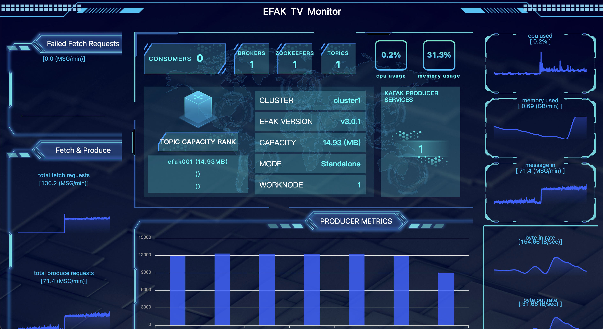

# 3.9 TV
## 3.9.1 Overview
We enter http://host:port/tv through the browser, access to the EFAK TV dashboard page. The page contains the following:

* Kafka Mem & CPU Chart
* Brokers ByteIn & ByteOut
* Topics Producer LogSize Monitor
* Cluster Nodes & Topics & Consumers etc
As shown in the following figure:

