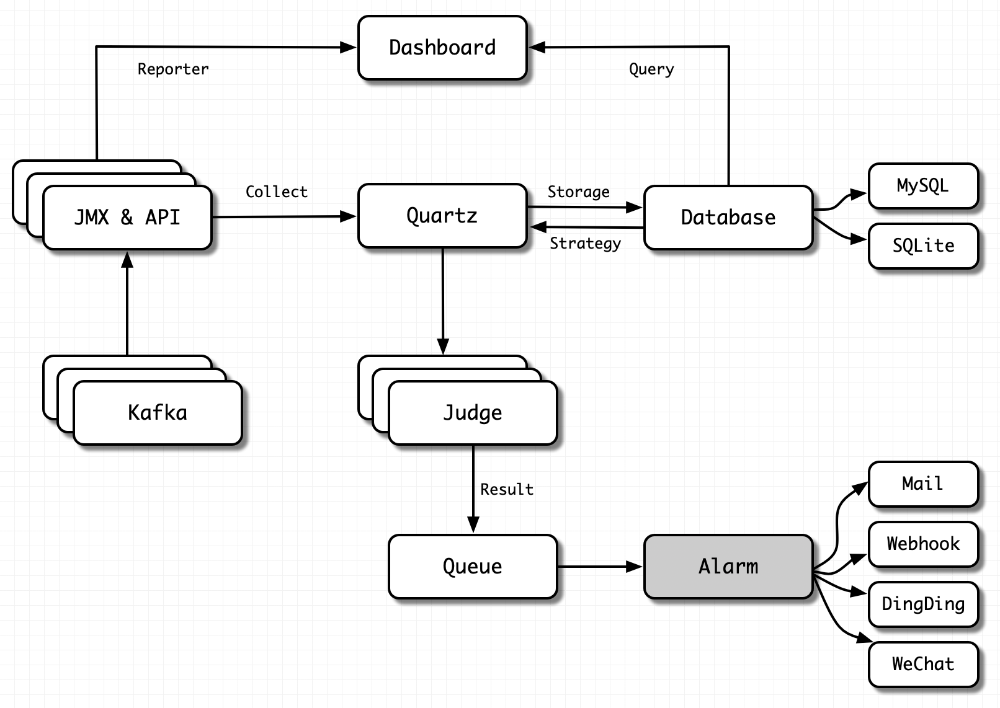

# 4.2 Data Collection

## 4.2.1 Overview
Monitor data is essential in a monitor system for the following analysis, graph, and alarm. How does EFAK deal with the problem of data collection?

For Kafka, that we can collect the following data

* Kafka broker common machine loading information: memory, cpu, IP, version etc.
* Service monitor data: TPS, QPS, RT etc.
* Applications monitor: groups, consumers, producers, topics etc.

That's quite a lot, which come from different interfaces, such as JMX, Kafka API, internal topic etc.



Let's focus on the three representative categories above.

## 4.2.2 Kafka Machine Loading Information
The collection of this category is universal. We can collect data through Kafka broker JMX, Kafka API etc.

It should be noted here that if data acquisition fails, it is necessary to insist on whether the network is limited, such as firewall policy.

We can test whether the corresponding port is available on the server where EFAK is deployed. The command is as follows:
```bash
# Test Kafka Broker Server
telnet kafka01 9092
# Test Kafka Broker JMX
telnet kafka01 9999
# Test Zookeeper Server
telnet zk01 2181
```

For the introduction of JMX, please visit [here](6.FAQ/1.FAQ.md).

> [!tip]
> For Kafka Broker JMX port, it can be set to any available port on the server, and EFAK will automatically identify.

## 4.2.3 Service Monitor Data
Service indicators such as QPS, TPS and RT reflect the performance of Kafka Broker services. These indicators are collected by different timers. After has finished collection, the collected data (from JMX or API) is stored in the database (such as MySQL or SQLite). Finally, the data is rendered in the dashboard to form a friendly graph web page.

> [!tip]
> When rendering the graphics, if the page display is abnormal, the static resources are not loaded successfully. The reason may be that the server has nginx installed, which limits the size of static resources (such as CSS, JavaScript, etc.). Users can modify the limit size of nginx on the server.

You can check if static resources are limited:

### Step1
Open the browser review element, switch to the network module, and check `Disable cache`.


### Step2
Switch to the console module, refresh the browser, and observe whether the console module is abnormal. If there is an exception, you can use the search engine to solve it according to the exception prompt.


## 4.2.4 Applications Monitor
Indicators such as consumer groups, consumers, producers, and topics reflect the health of client programs. We can analyze whether our application is normal by observing these indicators on the EFAK web page.

We don't need to make any settings for these indicator data. After the client program starts, EFAK will automatically identify, collect and store the data.

> ![tip]
> If the EFAK log throws an exception when collecting data, check whether the configuration file setting of EFAK is correct.

If your Kafka version is less than 0.10.x (0.8.x, or 0.9.x etc.), set as follows:
```bash
# Set Kafka Offsets Storage
cluster1.efak.offset.storage=zk
```

If your Kafka version is greater than 0.10.x (1.x, or 2.x, or 3.x etc.), set as follows:
```bash
# Set Kafka Offsets Storage
cluster1.efak.offset.storage=kafka
```
