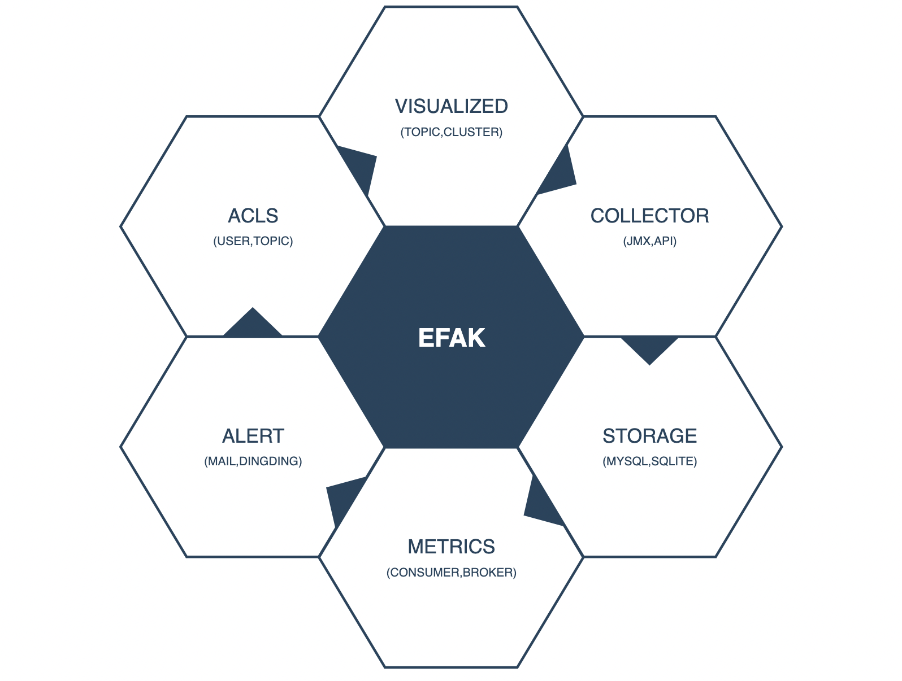

# 4.3 Core Modules

## 4.3.1 Overview
The monitor system is the most important link of the operation process even the lifecycle of a product. It sends alarms before accidents and provides detailed data for the investigation of issues. There are many choices of open source kafka monitor system as a muture product in operation industry.

So, we can look up EFAK feature and architecture.

## 4.3.2 Feature
EFAK consists of dashboard, collect, storage, alarm, authority authentication and other core feature modules. Each feature module is responsible for the following:

* **Dashboard**: Responsible for visualizing the performance indicators of Kafka cluster , analyzing the runtime of consumer and producer applications.
* **Collect**: Responsible for collecting performance indicators of all Kafka and service indicators of consumers and producers through timers.
* **Storage**: Responsible for storing all collected data, user metadata, user alarm data. Currently supports MySQL and SQLite.
* **Alarm**: Responsible for alarm exception indicators, such as broker shutdown, consumer blocking, producer write exception, etc. Currently supports Mail, DingDing, and WeChat.
* **Authentication**: Responsible for authority authentication and distinguish the use authority of different users. For example, the administrator can use all feature.

