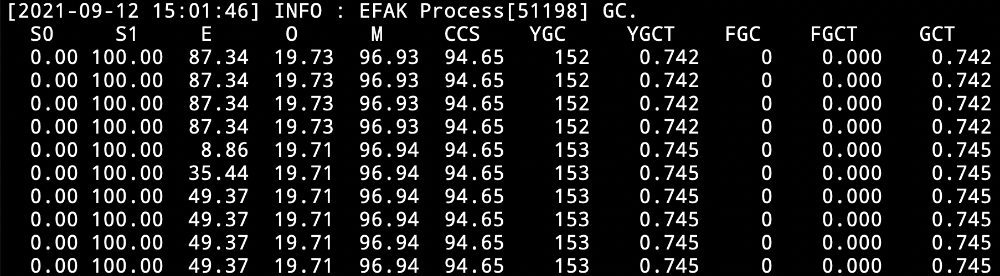

# 4.4 Advanced

## 4.4.1 Overview
EFAK has very low requirements for server hardware. Only 1 core of CPU and 2GB of memory can run, and it supports the whole platform (Linux, macOS, Windows). At the same time, EFAK can manage multiple Kafka clusters (without installing a EFAK service for each Kafka cluster).

## 4.4.2 Advanced
### KSQL
Users can easily use KSQL, can quickly query the data in topic.

### Consumers
Through the Consumers module. Users can view the runtime of consumer programs intuitively, and analyze and judge the health of applications with more graphs.

### Bash
Manage and view EFAK process service status through `ke.sh` script [command](3.Quick Start/6.Shell.md).

### JDK Encoding
When you deploy EFAK on the server where it is installed, the encode of the installed JDK is not UTF-8. When you use the mock feature of EFAK, you will get an exception when sending data in Unicode encoding format.

Then, You can run the following command:
```bash
ke.sh jdk
```


### GC
You can also view the process of EFAK by executing gc command:
```bash
ke.sh gc
```


